---
title:			Epitech Dump
subtitle:       Rigid like the stone
module:			none
branding:		dump
author:	   		Theodore Gozard
version:		1.0.0
---

<!-- # Before start -->

 
 
 

{width=50%}

::: note
**You are going to delete everything on your computer. If you forgot to backup some data please ask an APE. Once started, it will be too late**
:::

 
 
 
 

{width=40%}

::: center
*Don't forget, keep the stone in your pocket*
:::

\newpage

# 0. Disable Secure Boot

You have to disable secure boot. Fist you need to go in your BIOS settings. When powering your computer, you need to press a specific key to enter the bios menu. Depending on your computer's brand, this key may change.

:::tip
You have to spam the key while the computer is powering up until the boot menu shows up
:::

| **Brand**         | **BIOS/UEFI Setup Key** |
|-------------------|-------------------------|
| **Framework**     | F2                      |
| **Acer**          | Del or F2               |
| **ASUS**          | Del or F2               |
| **Dell**          | F2                      |
| **HP**            | Esc → F10               |
| **Lenovo**        | F1 or F2                |
| **MSI**           | Del                     |
| **Samsung**       | F2                      |
| **Gigabyte**      | Del                     |

Secure boot is often in security or boot section, search for it and **disable it**

 
{width=65%}

\newpage

# 1. Boot on USB stick

To install an operating system on your computer from a USB stick, you first need to select the usb stick as a boot device. When powering your computer, you need to press a specific key to enter the boot menu. Depending on your computer's brand, this key may change.

:::tip
You have to spam the key while the computer is powering up until the boot menu shows up
:::

| **Brand**         | **Boot Menu Key**       |
|-------------------|-------------------------|
| **Framework**     | F12                     |
| **Acer**          | F12 (enable in BIOS)    |
| **ASUS**          | Esc or F8               |
| **Dell**          | F12                     |
| **HP**            | Esc → F9                |
| **Lenovo**        | F12 or Fn + F12         |
| **MSI**           | F11                     |
| **Samsung**       | Esc or F12              |
| **Gigabyte**      | F12                     |

In the boot menu search the USB stick and press enter.

 

:::warning
If you get the following screen when booting on the USB stick, go to __[Enroll Ventoy Secure Boot Key](#enroll-ventoy-secure-boot-key)__
 
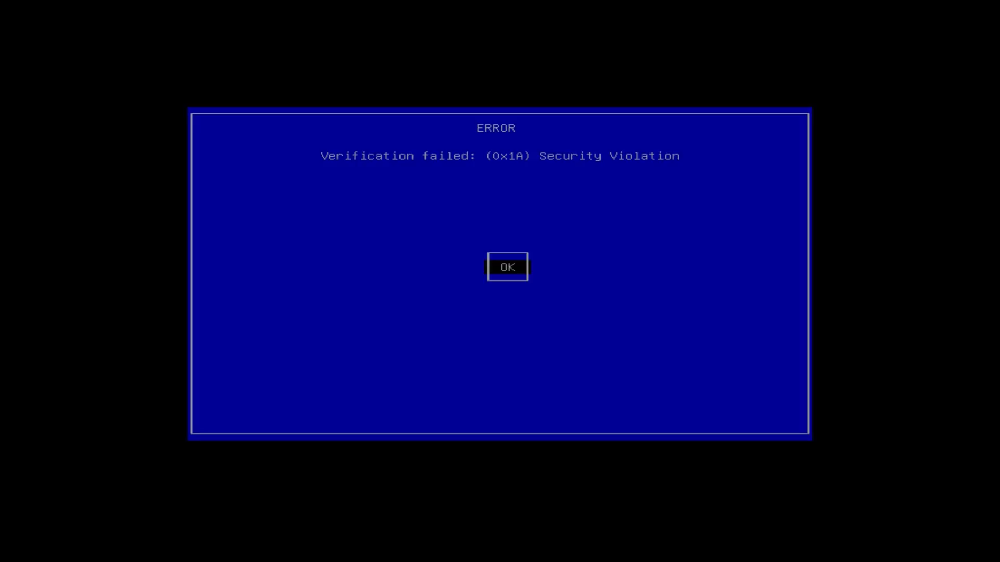{width=60%}
:::

\newpage

You can now choose Windows or Ubuntu depending on which operating system you want to install

 
{width=65%}

\newpage

# 2. Windows installation

Choose **Winboot mode** and press Enter

 
{width=70%}

\newpage

## Keyboard Layout

Choose the right **keybord layout** for you (Azerty or Qwerty in most case)
 
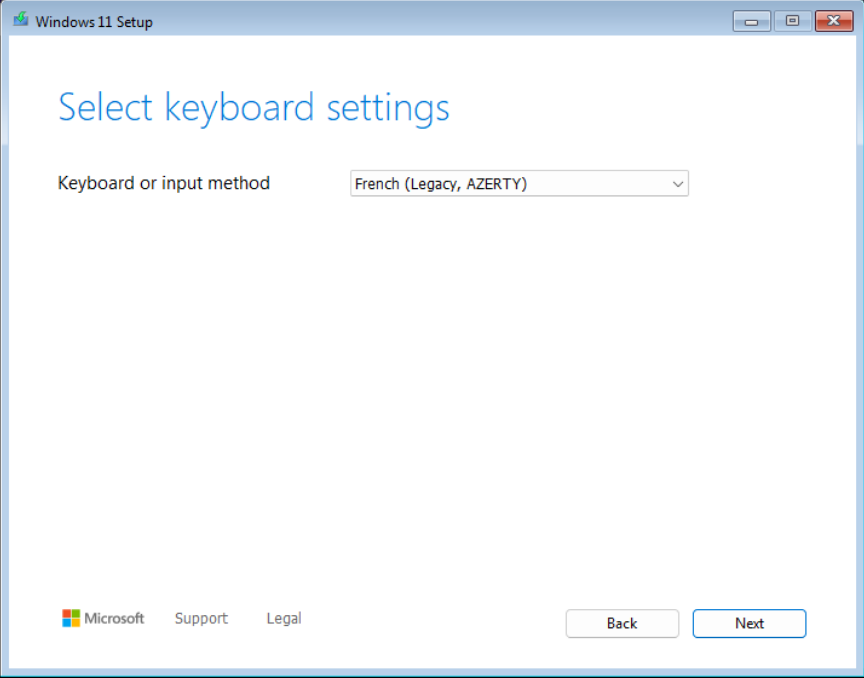{width=70%}

 
 

Delete disk partition
 
{width=70%}

 
 

Once logged into Windows, connect to the **IONIS Wifi**

**\textcolor{orange}{Username}** : *Epitech email*
**\textcolor{orange}{Password}** : *Epitech password*

:::note
If you can't connect to the wifi, ask an **APE**
:::

Once everything is finished and working, you can go the [Ubuntu installation page](#ubuntu)

\newpage

# 3. Ubuntu

:::tip
If you forgot how to **enter** the **boot menu**, go back to the __[Task 1 (boot on USB stick)](#boot-on-usb-stick)__
:::

Choose **Boot in normal mode** and press Enter

 
{width=70%}

\newpage

Select **Try or Install Ubuntu**

 
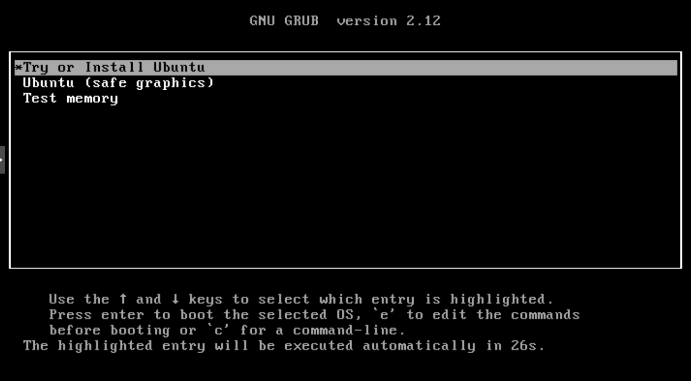{width=70%}

 
 

In language selection, select **English** then click next
 
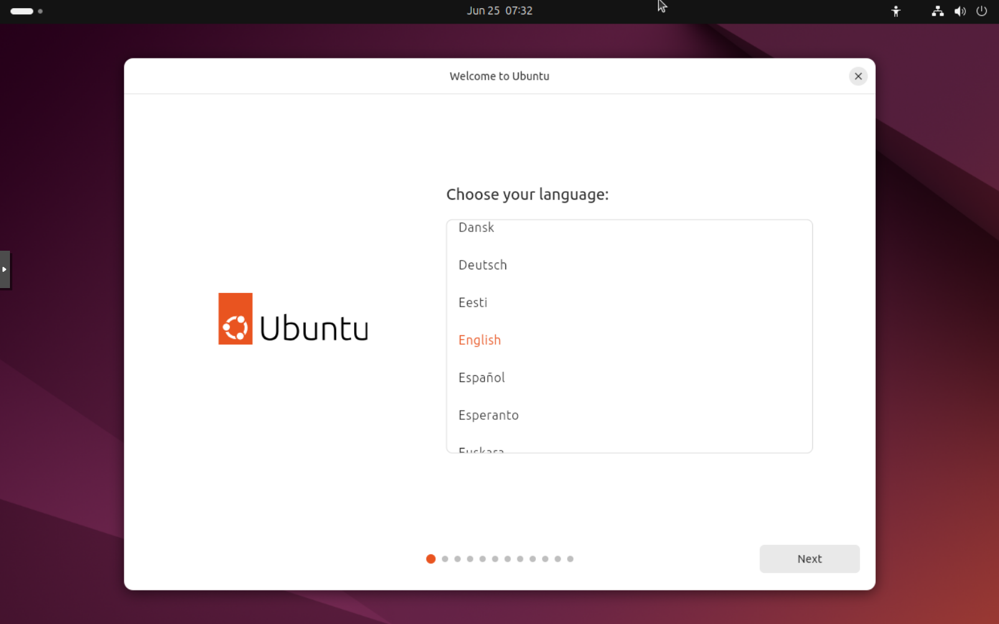{width=70%}

\newpage

Choose you **keyboard layout** (French or English in most case)
 
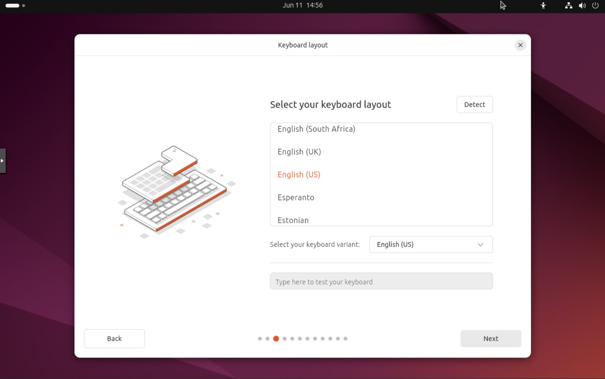{width=70%}

Choose **Do not connect to the internet**
 
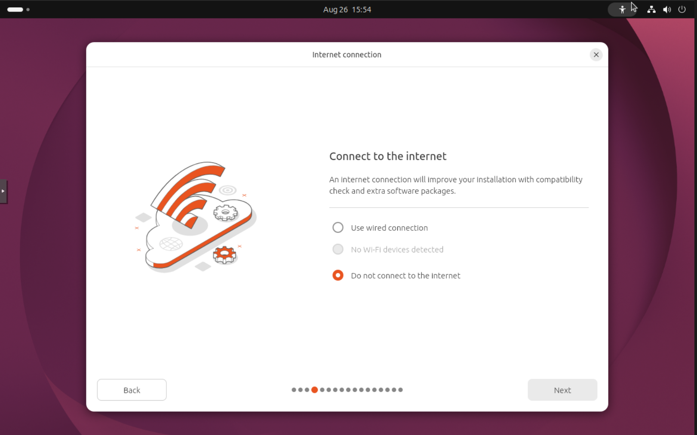{width=70%}

<!-- :::note
You need to get IONIS wifi, there is two options :

1. You already have your Epitech email and password. You can click on __[IONIS wifi connection page](#epitech-wifi)__.

2. You don't have your Epitech email and password. Send via sms **getwifi** to **06 44 63 42 42**. You will receive temporary login from IONISWIFI. Then you can click on __[IONIS wifi connection page](#epitech-wifi)__ and use those credentials.

Once connected to **IONIS wifi**, you can click on **Connect to wifi** or **Do not connect to the internet**
::: -->

\newpage

Choose **Install Ubuntu**
 
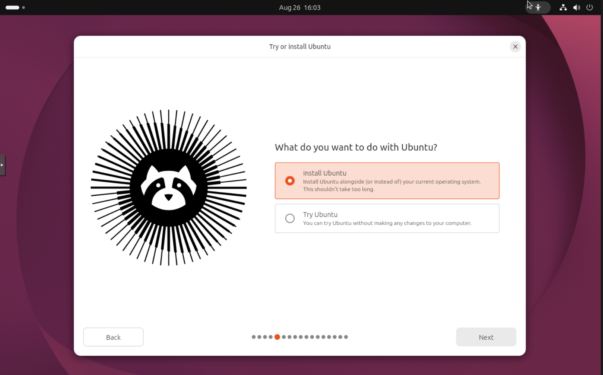{width=70%}

 
 

Choose **Interactive installation**
 
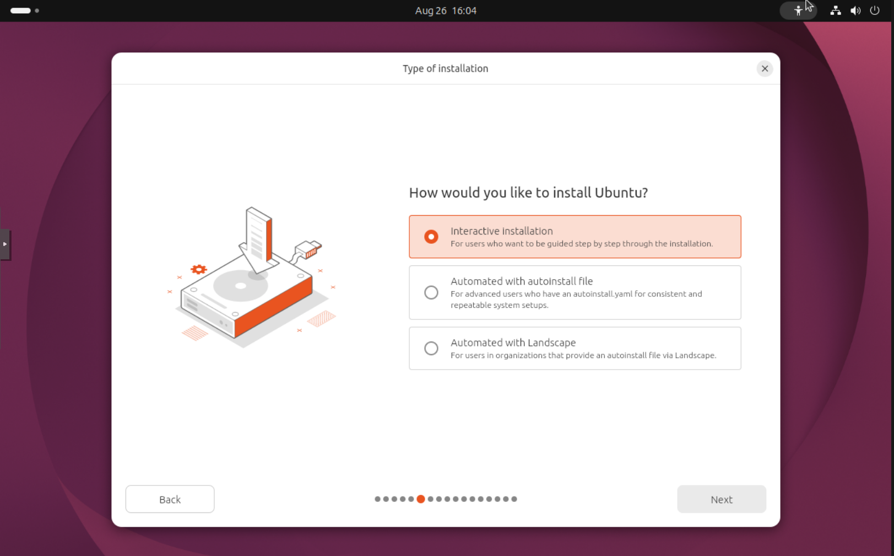{width=70%}

\newpage

<!-- ::: tip
Sometimes, the installer can crash. Don't worry ! Close and relaunch it, everything will work again
 
 

{width=70%}

 
 

::: center
Close the installer and reopen it
:::

 
  -->

\newpage

::: note
Call an **APE** before choosing Ubuntu disk space

 
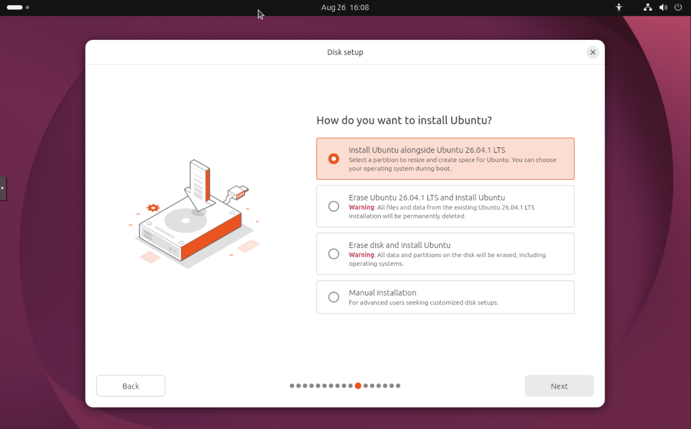{width=70%}
:::

 
 

Create your **local account for Ubuntu**

 
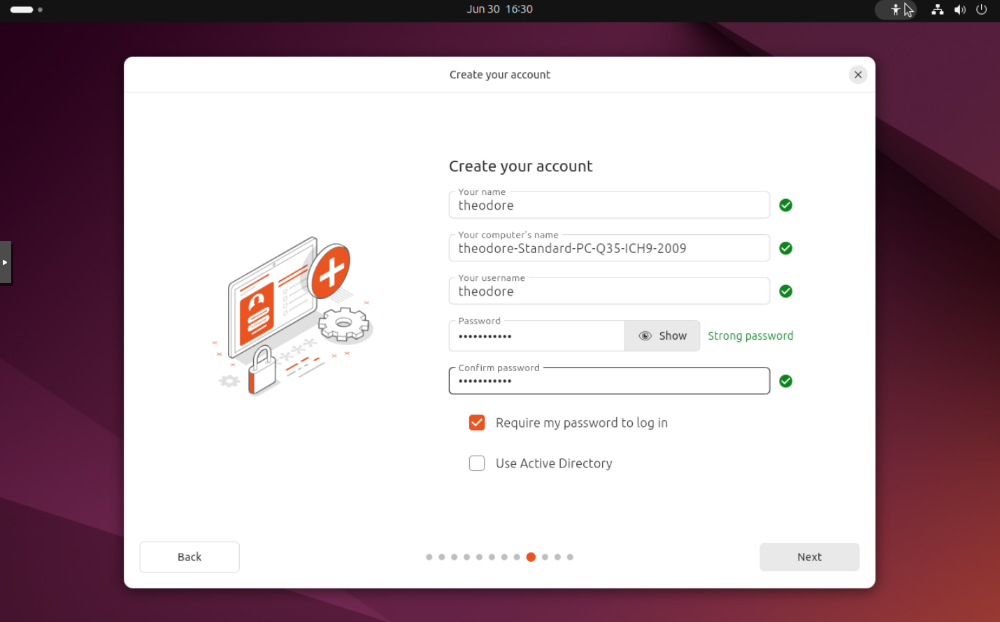{width=70%}

\newpage

Click on **install** to start installation

 
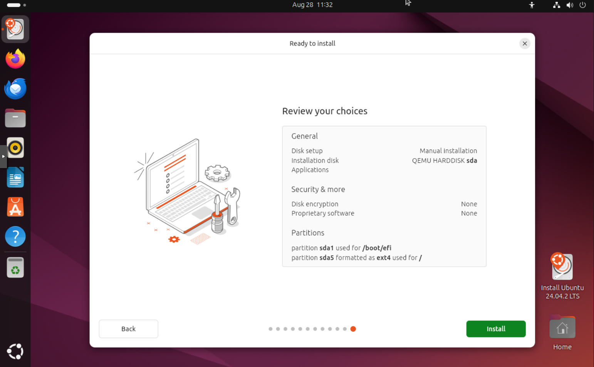{width=70%}

 

Wait for the install to finish !

 
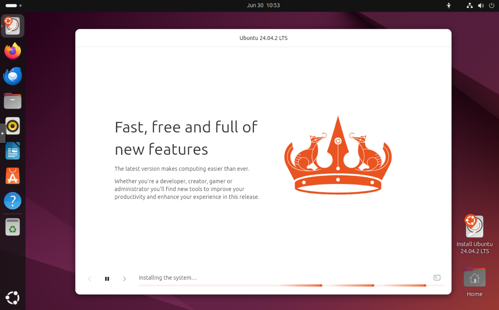{width=70%}

\newpage

# 4. Alpine

\newpage

# 5. Epitech tools

Now you want to discover and log into the most important tools that we use at Epitech

## Intranet

{width=10%}

Go on **[Intranet](my.epitech.eu)** *(my.epitech.eu)* in a web browser. Then you can login with **EPITECH ACCOUNT OFFICE 365** button. You have to use your **Epitech email and password**.

## Outlook (Office 365)

{width=10%}

At Epitech we use Outlook for emails. It's very important that you check your emails everyday because a lot of important informations will be given via mail. Go to **[Outlook](https://outlook.office.com/mail/)** *(outlook.office.com)*, you should already be logged in !

## Teams

{width=10%}

Teams is a Microsoft application for messaging. If you are not at school, it's your only way (with mail) for contacting an **APE**. Teams is already installed on your machine. Launch it and login with your **Epitech email address and password**

## Epitech Github Organisation

{width=10%}

:::tip
If you don't have a Github account, you first need to create one on **[create a Github account](https://github.com/signup)** *(github.com/signup)*
:::

You need to join the Epitech Github organisation, click on the following link : **[Epitech Organisation](https://github.com/orgs/EpitechPGE1-2026/sso)** *(github.com/orgs/EpitechPGE1-2026/sso)*

\newpage

# Epitech Wifi

**\textcolor{orange}{SSID}** : IONIS
**\textcolor{orange}{Wi-Fi Security}** : WPA & WPA2 Entreprise
**\textcolor{orange}{Authentication}** : Protected EAP (PEAP)
**\textcolor{orange}{No CA certificate is required}** : Check
**\textcolor{orange}{PEAP Version}** : Automatic
**\textcolor{orange}{Inner authentication}** : MSCHAPv2
**\textcolor{orange}{Username}** : *Epitech email*
**\textcolor{orange}{Password}** : *Epitech password*

 
{width=60%}

 

::: center
On the **top right corner**, click on the **wrench** and go to **Wifi settings**
:::

 
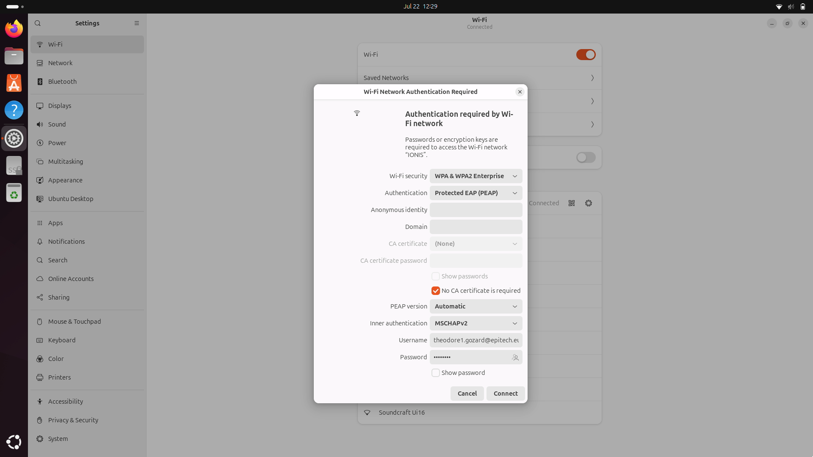{width=60%}

 

::: center
Select **IONIS Wifi** and fill the form with the correct informations
:::

# Enroll Ventoy Secure Boot Key

If you get this screen, it mean you need to enroll Ventoy secure boot key to allow your computer to run Ventoy and secure boot together. So the first step is to press enter

 
{width=65%}

 
 

**Press any to key** to perform MOK management and enroll a key

 
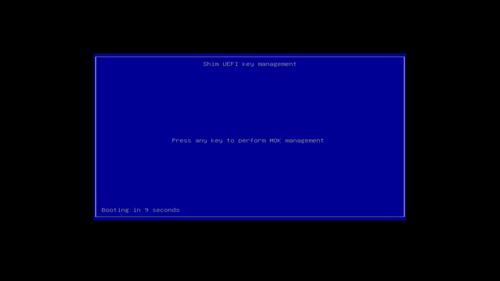{width=65%}

 
 

Select **Eroll key from disk**

 
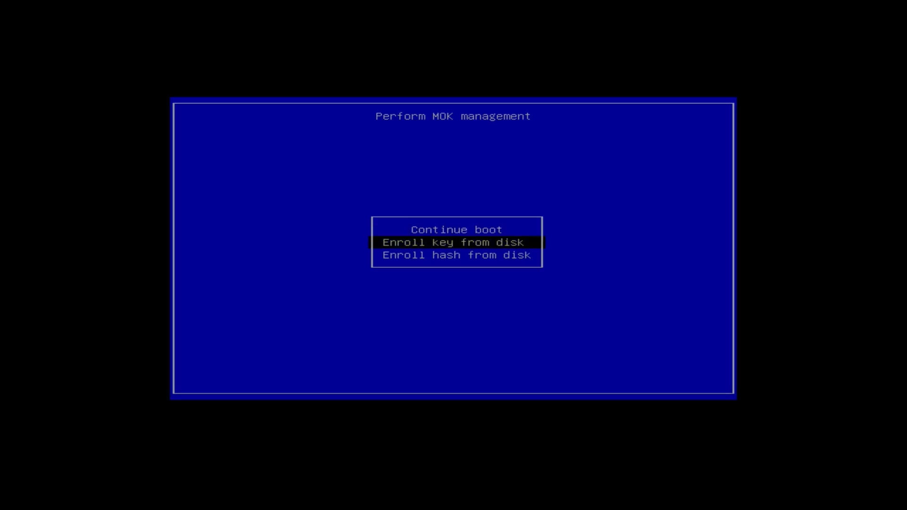{width=65%}

 
 

Select the folder **VENTOYEFI**

 
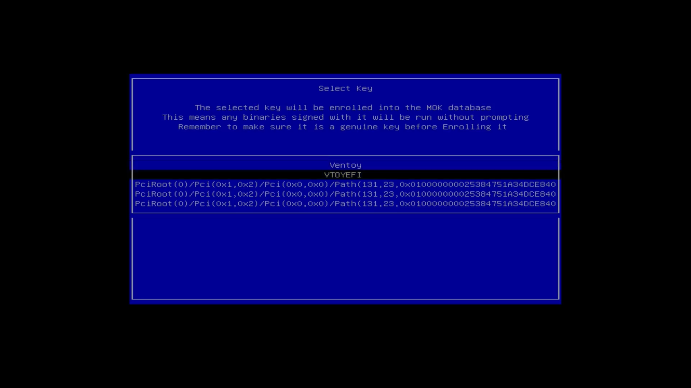{width=65%}

\newpage

Select **ENROLL_THIS_KEY_IN_MOKMANAGEMENT.cert**

 
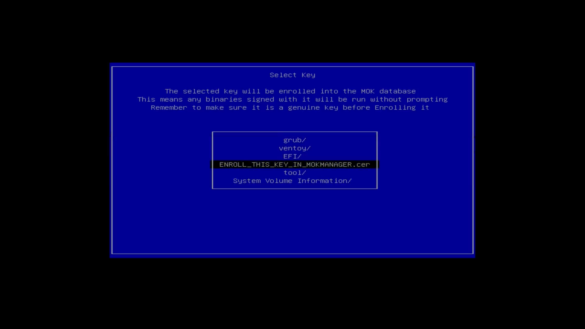{width=65%}

 
 

Click on **Continue**

 
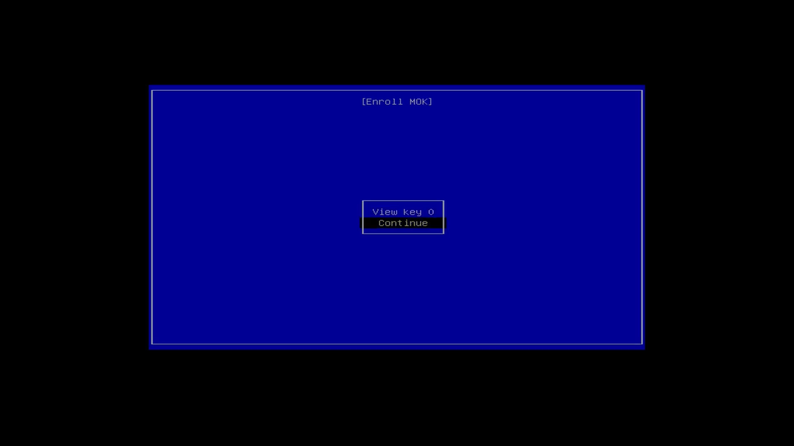{width=65%}

\newpage

Select **Yes** to enroll the key

 
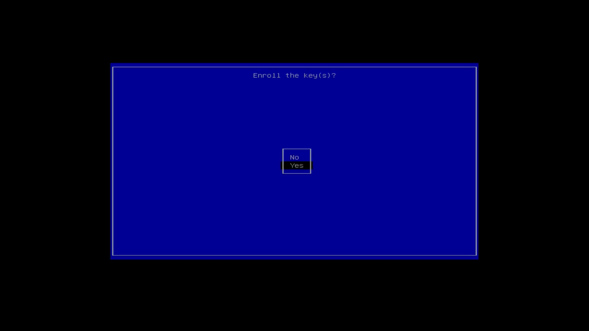{width=65%}

 
 

You can now **Reboot** and continue where you stopped !

 
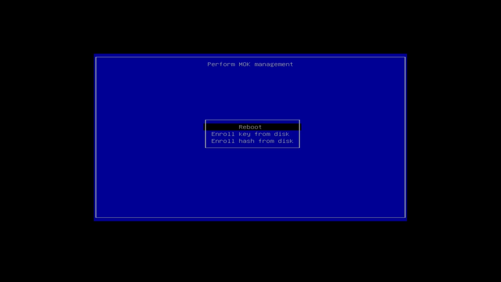{width=65%}
